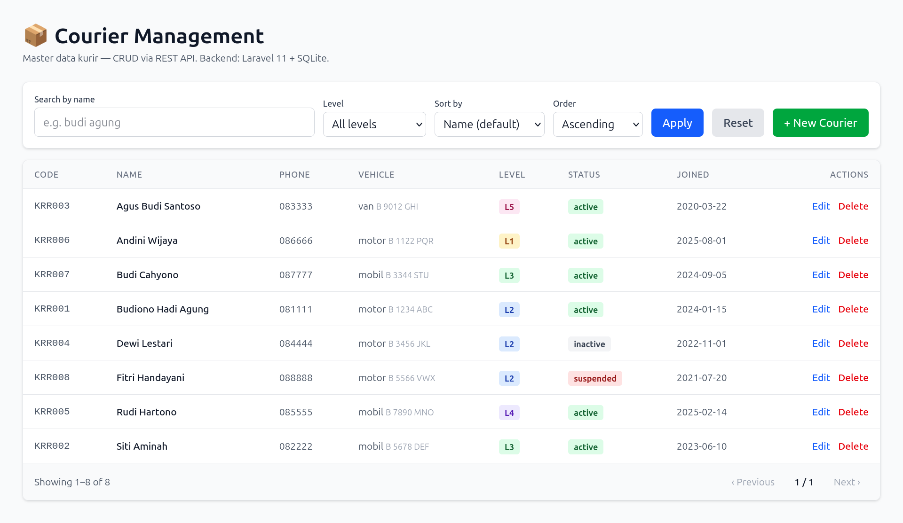
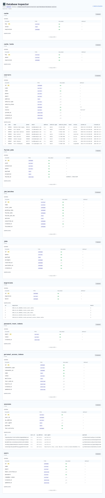

# Dokumentasi Bahasa Indonesia

> Versi lokal dari proyek ini. Versi default: [English](../en/README.md).

## Daftar Isi

- [Gambaran Umum](#gambaran-umum)
- [Cara Menjalankan](#cara-menjalankan)
- [Menjalankan di Browser Anda](#menjalankan-di-browser-anda)
- [Skema Database](#skema-database)
- [Referensi REST API](#referensi-rest-api)
- [Referensi Antarmuka Web](#referensi-antarmuka-web)
- [Aturan Validasi](#aturan-validasi)
- [Screenshot](#screenshot)

---

## Gambaran Umum

Courier API adalah proyek Laravel 11 yang menyediakan CRUD lengkap untuk tabel master `couriers` melalui dua jalur:

1. **REST API JSON** di bawah `/api/couriers` (controller `apiResource`).
2. **Antarmuka web Blade + Tailwind** di `/couriers` yang mengonsumsi JSON API di atas via JavaScript vanilla.

Tujuannya: server tetap tipis dan API jadi satu-satunya sumber kebenaran. UI cuma klien tipis yang render data dari API.

## Cara Menjalankan

```bash
composer install
cp .env.example .env
php artisan key:generate
touch database/database.sqlite
php artisan migrate --seed --force
npm install
npm run build
php artisan serve --host=127.0.0.1 --port=8000
```

- UI: http://127.0.0.1:8000/couriers
- API: http://127.0.0.1:8000/api/couriers

## Menjalankan di Browser Anda

Default `serve` hanya mengikat ke `127.0.0.1`. Untuk membuka dari browser **lokal Anda**, ada dua opsi:

### A. SSH port-forward (paling aman — tidak perlu ubah firewall)

Dari mesin lokal Anda:

```bash
ssh -L 8000:127.0.0.1:8000 alsa@<host>
```

Lalu buka http://127.0.0.1:8000/couriers di browser lokal.

### B. Expose ke LAN (perlu buka port di ufw)

```bash
php artisan serve --host=0.0.0.0 --port=8000
sudo ufw allow 8000/tcp
```

Lalu dari mesin mana pun di LAN yang sama, buka http://<ip-host>:8000/couriers.

> Host ini (`alsa`) menjalankan `ufw` dengan policy `DROP` di chain INPUT. Anda **harus** membuka port secara eksplisit kalau bind ke `0.0.0.0`.

## Skema Database

| Kolom           | Tipe              | Keterangan                                     |
|-----------------|-------------------|------------------------------------------------|
| `id`            | bigint (PK)       | auto-increment                                  |
| `code`          | string(32) unik   | kode internal, mis. `KRR001`                     |
| `name`          | string(120)       | nama lengkap (**wajib**)                         |
| `phone`         | string(32)        | nomor telepon                                    |
| `email`         | string(120)       | email                                            |
| `address`       | text              | alamat                                           |
| `vehicle_type`  | string(32)        | motor / mobil / van / truck / dll                |
| `vehicle_plate` | string(32)        | plat nomor                                       |
| `level`         | unsignedTinyInt   | 1-5 (1 = junior, 5 = senior) — **wajib**         |
| `status`        | string(16)        | active / inactive / suspended (default `active`) |
| `joined_at`     | timestamp         | tanggal mulai aktif                              |
| `created_at`    | timestamp         | tanggal didaftarkan                               |
| `updated_at`    | timestamp         |                                                  |

Index: `name`, `level`, `status`, plus unique index di `code`.

## Referensi REST API

Base URL: `/api/couriers`

### `GET /api/couriers` — Daftar + filter

#### Parameter query string

| Param      | Default  | Nilai yang diperbolehkan                      | Keterangan                                                                  |
|------------|----------|-----------------------------------------------|------------------------------------------------------------------------------|
| `search`   | —        | string (≤120 char)                            | Multi-token via spasi: `budi+agung` cocok ke `Budiono Hadi Agung`. Setiap token harus substring dari `name`. |
| `level`    | —        | daftar int 1-5 dipisah koma                   | `level=2,3` mengembalikan kurir level 2 ATAU 3.                              |
| `sort`     | `name`   | `name` \| `created_at`                        | Default `name` ascending.                                                    |
| `order`    | `asc`    | `asc` \| `desc`                               |                                                                              |
| `per_page` | 15       | int 1-100                                      | Item per halaman.                                                            |
| `page`     | 1        | int ≥ 1                                        | Nomor halaman.                                                               |

#### Respons — `200 OK`

Paginator standar Laravel:

```json
{
  "current_page": 1,
  "data": [
    {
      "id": 1,
      "code": "KRR001",
      "name": "Budiono Hadi Agung",
      "phone": "081111",
      "email": "budi@example.com",
      "address": null,
      "vehicle_type": "motor",
      "vehicle_plate": "B 1234 ABC",
      "level": 2,
      "status": "active",
      "joined_at": "2024-01-15T00:00:00.000000Z",
      "created_at": "2026-08-12T02:24:47.000000Z",
      "updated_at": "2026-08-12T02:24:47.000000Z"
    }
  ],
  "first_page_url": "...",
  "from": 1,
  "last_page": 3,
  "last_page_url": "...",
  "links": [...],
  "next_page_url": "...",
  "path": "...",
  "per_page": 15,
  "prev_page_url": null,
  "to": 8,
  "total": 22
}
```

#### Contoh

```bash
# Default (urut nama asc)
curl http://127.0.0.1:8000/api/couriers

# Cari 'budi agung' — semua token harus substring dari nama
curl "http://127.0.0.1:8000/api/couriers?search=budi+agung"

# Filter level 2 atau 3
curl "http://127.0.0.1:8000/api/couriers?level=2,3"

# Urut tanggal daftar, terbaru duluan
curl "http://127.0.0.1:8000/api/couriers?sort=created_at&order=desc"

# Kombinasikan filter + search + sort
curl "http://127.0.0.1:8000/api/couriers?level=2,3&search=budi&sort=name"

# Pagination — halaman 2 dengan 5 per halaman
curl "http://127.0.0.1:8000/api/couriers?per_page=5&page=2"
```

### `POST /api/couriers` — Buat

#### Body

| Field           | Tipe    | Wajib | Constraint                                |
|-----------------|---------|-------|-------------------------------------------|
| `name`          | string  | ya    | max 120                                   |
| `level`         | int     | ya    | 1-5                                       |
| `code`          | string  | no    | max 32, harus unik                        |
| `phone`         | string  | no    | max 32                                    |
| `email`         | string  | no    | format email valid, max 120               |
| `address`       | string  | no    | max 1000                                  |
| `vehicle_type`  | string  | no    | max 32                                    |
| `vehicle_plate` | string  | no    | max 32                                    |
| `status`        | string  | no    | salah satu dari: `active`, `inactive`, `suspended` (default `active`) |
| `joined_at`     | date    | no    | ISO 8601                                  |

#### Respons — `201 Created`

```json
{
  "message": "Courier created",
  "data": { "...row baru..." }
}
```

#### Contoh

```bash
curl -X POST http://127.0.0.1:8000/api/couriers \
  -H "Content-Type: application/json" \
  -d '{"name":"Joko Anwar","level":3,"code":"KRR010","phone":"08123","email":"joko@example.com"}'
```

### `GET /api/couriers/{id}` — Detail

```bash
curl http://127.0.0.1:8000/api/couriers/1
```

Respons — `200 OK`:

```json
{ "data": { "id": 1, "name": "...", ... } }
```

Kalau id tidak ada → `404` dengan pesan.

### `PUT /api/couriers/{id}` — Update

Schema body sama dengan `POST` (semua opsional, kecuali `name` dan `level` tetap wajib). Rule unique `code` mengabaikan id row sendiri, jadi kirim ulang code yang sama aman.

```bash
curl -X PUT http://127.0.0.1:8000/api/couriers/1 \
  -H "Content-Type: application/json" \
  -d '{"name":"Joko Anwar","level":4,"status":"inactive"}'
```

Respons — `200 OK`:

```json
{ "message": "Courier updated", "data": { "...row yang sudah diupdate..." } }
```

### `DELETE /api/couriers/{id}` — Hapus

```bash
curl -X DELETE http://127.0.0.1:8000/api/couriers/1
```

Respons — `200 OK`:

```json
{
  "message": "Courier deleted",
  "id": 1,
  "still_in_db": "no"
}
```

Setelah ini, `GET /api/couriers/1` akan `404`.

## Referensi Antarmuka Web

Buka http://127.0.0.1:8000/couriers.

Halaman ini adalah satu Blade view yang berisi **8 kurir contoh** (dari `CourierSeeder`). Antarmukanya:

- **Search box** — logika sama dengan param API `search` (multi-token, semua harus match).
- **Filter Level** — `All levels`, `Level 1-5`, atau compound `Level 2 or 3`, `Level 1, 2, or 3`.
- **Sort by** — `Name` (default) atau `Date registered`.
- **Order** — Ascending / Descending.
- **Tombol Apply / Reset**.
- **+ New Courier** — buka modal untuk create.
- **Tombol Edit / Delete** per baris.
- **Pagination** — `‹ Previous` / indikator halaman / `Next ›`.

Semua aksi memanggil endpoint REST yang sama — halaman ini tidak pernah submit form HTML.

## Aturan Validasi

Untuk `POST` dan `PUT`:

| Field           | Aturan                                                        |
|-----------------|---------------------------------------------------------------|
| `name`          | `required`, `string`, `max:120`                                |
| `level`         | `required`, `integer`, `between:1,5`                           |
| `code`          | `nullable`, `string`, `max:32`, `unique:couriers,code`        |
| `phone`         | `nullable`, `string`, `max:32`                                 |
| `email`         | `nullable`, `email`, `max:120`                                 |
| `address`       | `nullable`, `string`, `max:1000`                               |
| `vehicle_type`  | `nullable`, `string`, `max:32`                                 |
| `vehicle_plate` | `nullable`, `string`, `max:32`                                 |
| `status`        | `nullable`, `in:active,inactive,suspended`                     |
| `joined_at`     | `nullable`, `date`                                             |

Validasi gagal → `422`:

```json
{
  "message": "Validation failed",
  "errors": {
    "level": ["The level field must be between 1 and 5."]
  }
}
```

Untuk query param di `GET /api/couriers`:

| Param      | Aturan                                  |
|------------|-----------------------------------------|
| `search`   | `nullable`, `string`, `max:120`         |
| `level`    | `nullable`, `string`, `max:32`          |
| `sort`     | `nullable`, `in:name,created_at`        |
| `order`    | `nullable`, `in:asc,desc`               |
| `per_page` | `nullable`, `integer`, `1..100`         |
| `page`     | `nullable`, `integer`, `min:1`          |

## Screenshot

### Halaman daftar kurir — `/couriers`

UI utama: search box, filter level, sort selector, pagination, dan tombol edit/delete per baris.



### Database inspector — `/admin/db`

Inspektur read-only: schema per tabel (kolom, tipe, nullable, default, PK) plus sample data.

